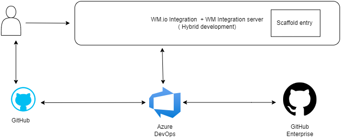
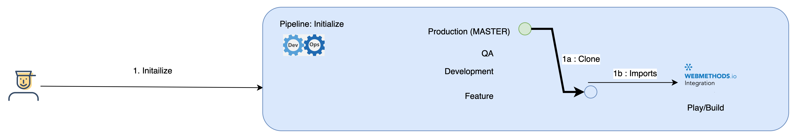

# wmio_project_d
 This article shows how to design and setup an automated CI/CD process and framework for Hybrid integration setup with 
 webMethods.io using the inbuilt APIs (or CLI). Here we have used Azure DevOps as our orchestration platform, 
 GitHub as repository platform and Postman/Newman as test framework. 

# Use-case
When organizations start using webMethods.io Integration along with on-premise integration for business use-cases, the need for having a continuous integration and delivery process becomes very important. These processes will enable the business to have a "Faster release rate", "More Test reliability" & "Faster to Market".
This use-case will highlight a solution utilizing below 
1) scaffodls/manifest.yaml file which mentions repository URL and project type ( on premise/ API/ WMIO etc.)
2) for WebMethods.io (cloud) - webMethods.io import & export APIs (or CLI) and Azure Devops to extract and store the code assets in repository (GitHub).
3) for Webmethos IS (onpremise) - webMethods IS local service development and Azure DevOps to extract and store the code assets in repository (GitHub).
By integrating repository workflows and azure pipelines, this process will automate the promotion of assets to different stages/environment as per the organizations promotion workflow. This will also showcase how to automate the test framework for respective stages/environments.

   

# Assumptions / Scope / Prerequisite
1. 4 Environments: Play/build, Dev, QA & Prod. 
2. Azure DevOps as Orchestration Platform
3. GitHub: as the code repository
4. GitHub Enterprise: For Pipelines/Scripts
5. Postman/Newman as test framework
6. Microsoft’s self-hosted agent on the build server where ABE and webMethods deployer are installed for IS packages
7. Scaffolds/manifest.yaml file updated for assets

# Git Workflow
We will assume that the organization is following the below GIT Workflows.

    

# Steps
1. **Initialize**
   1. Developer starts by executing *Initialize Pipeline* (Automation)
   2. This checks if the request is for an existing asset or a new implementation
   3. If new, automation will 
      1. Initialize a repository
      2. Create standardized branches, including requested Feature Branch
      3. Create a project in Play/Build environment
   4. If existing, automation will
      1. Clone the Prod branch to Feature branch
      2. Import asset to Play/Build environment

For hybrid integration use case, scaffolds/manifest.yaml file is read and based on that either of below steps is taken as a part of initialization process.

For WM.io Assets (say Type ='wm_io_inetgration')
         **API's Used** 
   *  /projects/{{*projectName*}}, 
   *  /projects/{{*projectName*}}/workflow-import, 
   *  /projects/{{*projectName*}}/flow-import, 
   *  /ut-flow/referencedata/{{*projectUID*}}/{{*referenceDataName*}}, 
   *  /ut-flow/referencedata/create/{{*projectUID*}}, 
   *  /ut-flow/referencedata/update/{{*projectUID*}}/{{*referenceDataName*}}, 
   *  /projects/{{*projectName*}}/params/{{*parameterUID*}}, 
   *  /projects/{{*projectName*}}/params
  
  
  

For On premise assets i.e. IS packages (say Type ='OnPrem')
